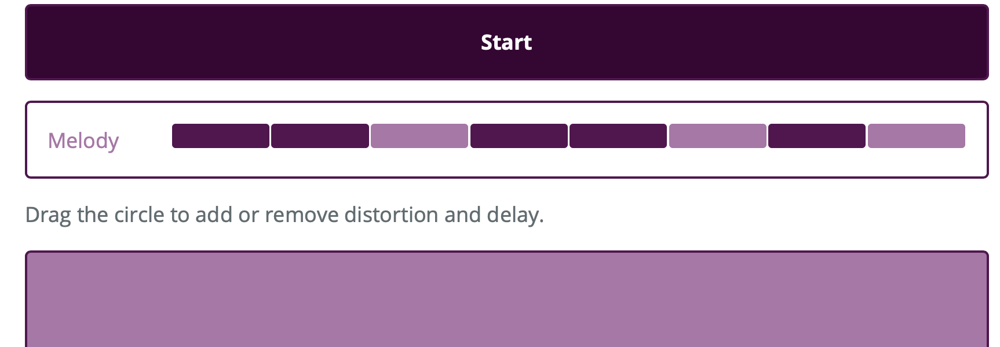

# Loop Builder

This is a test project that links [tone.js](https://tonejs.github.io) to a graphical interface to create looping melodies and rhythms.

## Features

* Manipulate the timbre of generated synthesizer melodies using a graphical effects controller

### Next

* Add color box flashes
* Add control to change melody and bass loops
* Add control to change drum loop
* Write a short introduction
* Allow saving and loading

## Sounds

* Cowbell sound is from [GowlerMusic on freesound.org](https://freesound.org/people/GowlerMusic/sounds/364919/)
